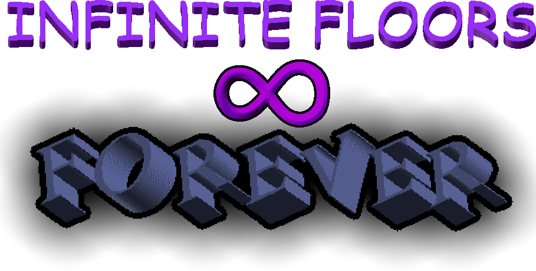

# 

A continuation of the Infinite Floors mod aka: Arcade Mode
### As of Plus v0.13 status update, this mod will be discontinued at v0.13 pre-release but there may be a new mod in progress that is Infinite Floors but without its additions such as its own upgrade system, upgrade shop, F99, and Forever's contents such as bounty house sell shop, new game+, and Juan. The difficulty will also be overhauled by the time this new mod is decided that it goes into development.

# Assets credits
* Texture sets included:
  * Deltarune Light World, parts of Corn Maze - Unknown
  * B. Carnell-themed sets, Deltarune Dark World idea, Textured With Blocks - AlexBW145
  * Ceiling of Corn Maze - Excavator Man
  * Classic Maze - Ripped from that one maze
  * Fun House - Ripped from Marcello's Fun House(?)
* F99 Music - Borrowed from Rapparep
* Restock & Map Fill posters in Upgrade Warehouse shop - B-Side Skid (on Gamebanana)
* New speedy boots upgrade icons - AlexBW145

# Prerequisites
- [BepInEx 5](https://github.com/BepInEx/BepInEx/releases)
- [MTM101BaldAPI 8.1](https://gamebanana.com/mods/383711)
- Visual Studio

Put the BepInEx core DLLs and the MTM101BaldAPI dll into a folder named "Dependencies", it's likely it doesn't already exist so you need to create it.
Load up the solution in Visual Studio and you should be able to build.

The resources folder must be put in StreamingAssets/Modded and renamed to "mtm101.rulerp.baldiplus.endlessfloors".
